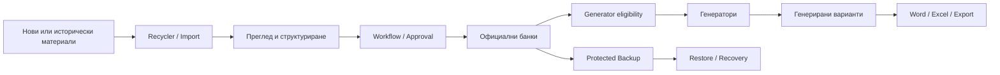
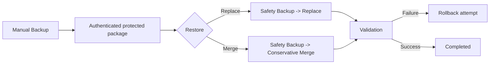
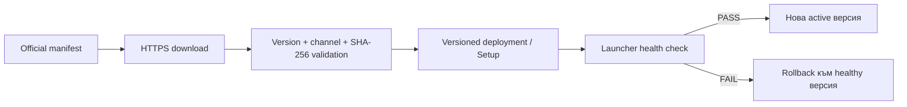

# ArsExam Desktop — официални версии, изтегляне и описание на програмата

**ArsExam Desktop** е native Windows, offline-first система за управление на дигитални ресурси, свързани с Държавния зрелостен изпит по Теория на професията **„Музикално изкуство“**.

Това repository — **`pgnev/arsexam-releases`** — е единственият официален публичен канал за:

- ArsExam Setup файлове;
- application update пакети;
- Stable/Test update manifests;
- immutable public release assets;
- публични release notes и integrity информация.

Изходният код **не се публикува тук**.

**Автор и разработчик:** Petko Ganev  
**Поддръжка:** petkoganev@gmail.com  
**Copyright © 2026 Petko Ganev. All rights reserved.**

> [!IMPORTANT]
> Изтегляйте ArsExam само от официалните Releases в това repository. Не приемайте binary от друг repository, mirror, чат или произволен file-sharing източник като официална версия само защото носи ArsExam име или икона.

---

# 1. Какво е ArsExam

ArsExam е специализирано Desktop приложение за целия локален жизнен цикъл на изпитното съдържание:



Програмата е създадена така, че автоматизацията да подпомага експерта, но да не замества човешката преценка с догадка. Когато key, Media, provenance или структура са нееднозначни, съдържанието остава за преглед вместо да бъде автоматично „поправено“ по несигурен начин.

---

# 2. За кого е предназначена

ArsExam е предназначена за преподаватели, експерти, автори и редактори, които:

- поддържат изпитни банки;
- редактират въпроси и задачи;
- анализират исторически изпитни материали;
- изграждат и проверяват изпитни варианти;
- работят с нотни примери, изображения и аудио;
- трябва да пазят работните данни локално и да разполагат с надежден Backup/Restore механизъм.

---

# 3. Основни функции

## 3.1. Банки за трите изпитни модула

ArsExam поддържа структурирано съдържание за:

- **Модул 1** — въпроси с отговори, теми, сектори, свойства, Media, difficulty и generator rules;
- **Модул 2.1** — комплексни задачи с главни въпроси/подвъпроси, точки, key и приложими Media;
- **Модул 2.2** — отворени/практически задачи, включително Теория, Хармония и Музикални форми / анализ;
- **Модул 3** — теми, профили, номер на тема и workflow/generator state.

## 3.2. Workflow

Потребителските работни статуси са:

1. **Чернова**;
2. **За преглед**;
3. **За одобрение**;
4. **Одобрен**;
5. **Отхвърлен**;
6. **Архивиран**.

Важно: **„Одобрен“ не означава автоматично „Допустим за генератор“**. Generator eligibility се проверява отделно чрез модулните structural правила.

## 3.3. Генератори

### Модул 1

Генераторът създава точно **30 въпроса**:

| Група | Брой |
|---|---:|
| Слухови | 4 |
| Теория | 6 |
| Хармония | 7 |
| Музикални форми / анализ | 6 |
| История на музиката | 7 |
| **Общо** | **30** |

Прилагат се candidate availability, topic/structure правила, shuffle на въпросите и независимо shuffle на отговорите с запазване на верния answer mapping.

### Модул 2

Генераторите използват само structurally valid, approved и generator-eligible задачи и прилагат необходимия точков/структурен contract.

### Модул 3

Използва profile/topic generator workflow и отделни правила от числовата difficulty методология на Модул 1/2.

## 3.4. Multi-select търсене

Банките използват checkbox multi-select филтри:

- OR вътре в един categorical filter;
- AND между различни filters;
- contextual Module 1 themes;
- cumulative Module 1 properties;
- Difficulty/Status/Discipline/Profile/Topic filters според модула.

## 3.5. Difficulty methodology

ArsExam поддържа versioned difficulty methodologies, automatic explainable assessment и отделен expert override.

Модул 1/2 generator difficulty choices са concrete bands:

- **Лесно**;
- **Средно**;
- **Трудно**.

## 3.6. Recycler

Recycler обработва исторически и нови source материали и ги превръща в reviewable structured content.

Поддържаният модел включва:

- цели изпитни документи;
- смесени документи;
- самостоятелни tasks/fragments;
- key/criteria fragments;
- нотни/графични материали;
- audio;
- local OCR/layout extraction при приложимите източници.

Критичен принцип е **no silent drop**: неразпознат или нееднозначен материал трябва да остане видим чрез review state/evidence/outcome, а не да изчезне.

## 3.7. Import / Approval

Външното съдържание преминава през staging, validation, review и explicit workflow решение преди да стане official bank content.

Manual Media/association действие не auto-approve-ва съдържанието и не включва generator eligibility автоматично.

## 3.8. Media

ArsExam работи с локални:

- изображения;
- notation/score материали;
- аудио.

Missing/conflicting/ambiguous Media остава review-gated.

## 3.9. Word и Excel

- DOCX output се създава чрез Open XML;
- XLSX import/export използва ClosedXML;
- Microsoft Word/Excel не са runtime requirement за самото генериране/обработване на файловете.

## 3.10. Bank Quality

Инструментите за качество могат да подпомагат откриване и контролирана обработка на:

- duplicates;
- key conflicts;
- structural defects;
- missing Media;
- archive/merge/remove решения.

Destructive operations използват приложим preview/confirmation/audit/Safety Backup contract.

---

# 4. Offline-first работа

Основните функции работят локално и не изискват постоянен internet:

- локален профил и вход;
- банки;
- генератори;
- Recycler;
- Import/Approval;
- Word/Excel;
- Backup/Restore;
- Desktop/Portable data workflows.

Интернет се използва за:

1. официална проверка/изтегляне на update;
2. доброволна opt-in crash/error диагностика, когато е включена.

Няма задължителен cloud account за normal bank/generator workflow.

---

# 5. Desktop и Portable

## Desktop

Desktop installation държи versioned application binaries отделно от persistent user data.

## Portable

Portable режимът позволява пренасяне на приложението и неговия portable data root между поддържани Windows x64 компютри.

Типичните persistent категории включват:

- `Data`;
- `Media`;
- `Import`;
- `Export`;
- `Backup`;
- `Templates`;
- `Documentation`.

> [!CAUTION]
> Portable storage не означава автоматично, че всеки Media файл е индивидуално криптиран. При чувствителен removable носител използвайте подходяща OS/storage защита.

---

# 6. Локална сигурност

ArsExam използва локален защитен профилен/storage модел.

Основни принципи:

- plaintext profile password не се съхранява;
- profile password не е директно database encryption key;
- local security envelope/master-key state отделя authentication от data encryption;
- няма universal server-side master password/backdoor.

## Recovery Key

Recovery Key е локален single-use forgotten-password credential.

Той:

- не съдържа паролата;
- не е Backup password;
- не е transfer code;
- след успешно recovery се инвалидира и се издава нов.

---

# 7. Backup и Restore

ArsExam използва защитен `.arsexam-backup` формат.

Backup credential е отделен от profile password и Recovery Key.



### Replace

Заменя приложимото work state след validation и Safety Backup.

### Merge

Добавя допустимото incoming content консервативно, като пази current target state за съществуващи записи и блокира конфликтни methodology/file definitions преди mutation.

---

# 8. Актуализации

ArsExam използва официалните manifests в това repository.



Потребителските `Data/Media/Import/Export/Backup` не са normal application update payload.

Подробно описание: [`update/README.md`](update/README.md).

---

# 9. Privacy и diagnostics

Crash/error diagnostics са:

- OFF по подразбиране;
- opt-in;
- без usage/behavior analytics;
- ограничени до минимизиран technical payload според consent contract-а.

Основните банки, генератори, Recycler и Backup/Restore не изискват remote diagnostics.

---

# 10. Системни изисквания

Официалната native Desktop линия е предназначена за:

- Windows 10 / Windows 11;
- x64 архитектура.

Self-contained distribution не изисква предварително инсталиран .NET Runtime.

Няма runtime зависимост от Python, Node.js, npm, Microsoft Access, browser или localhost server.

---

# 11. Текущ официален статус

| Канал | Версия | Статус |
|---|---:|---|
| **Stable** | **3.7.1** | **CURRENT STABLE — публикуван на 05.09.2026** |
| Previous Stable | 3.6.3 | immutable historical release |
| Test | отделен prerelease/testing channel | authority: `update/test-manifest.json` |

Machine-readable update authority са:

- `update/stable-manifest.json`;
- `update/test-manifest.json`.

---

# 12. ArsExam 3.7.1 Stable

Официален release: **`v3.7.1`**

Основни assets:

- `ArsExam_Setup_3.7.1_win-x64.exe`;
- `ArsExam_Update_3.7.1_win-x64.zip`;
- `update-manifest.json`.

## SHA-256

### Setup

```text
EA3E7CB9D9D24D910A183412A9124015CE92A005FFC4FBDEE3B3018E952856F3
```

### Update ZIP

```text
64B151B2514635C718D72CB6C9ECDD318F6EF1FED539BD72BF3F09F34ABA26B2
```

## Source/release binding

- canonical source: `pgnev/arsexam-source`;
- immutable source tag: `v3.7.1`;
- exact tagged source SHA: `7eed9fafbe89cc399f0980856632dfc11637cc88`;
- validated source tree SHA: `882779e4c1b27999547c085b411020a8b0b9e5ad`;
- exact-tag local release gate: PASS — 735/735 tests, 7/7 updater matrix;
- exact-tag Windows/Sentry acceptance: PASS.

Hosted exact-tag Actions опитът е приключил със startup failure преди jobs; release policy е използвала документирания exact-tag local fallback.

---

# 13. Какво включва 3.7.1

Основният user-facing акцент на 3.7.1 е multi-select filtering в банковите модули:

- checkbox categorical filters;
- OR вътре в filter и AND между filters;
- Module 1 cumulative properties и master `Всички свойства`;
- contextual Module 1 themes;
- Difficulty/Status/Discipline/Profile/Topic filters според модула;
- layout/spacing подобрения;
- Module 3 new-topic creation изисква точно един profile.

Версията включва и release/documentation consistency подобрения, включително curated end-user documentation и коректно runtime version binding за приложимите Privacy/Third-party surfaces.

---

# 14. Code signing — важно за Windows предупрежденията

**ArsExam 3.7.1 Stable е публикуван без Authenticode подпис.**

Поради това Windows/SmartScreen може да покаже предупреждение като **Unknown Publisher**, в зависимост от локалната policy и reputation state.

Това трябва да се различава от integrity проверката:

- HTTPS защитава transport path-а;
- SHA-256 позволява сравнение с authoritative release hash;
- Authenticode удостоверява publisher identity чрез code-signing certificate.

За 3.7.1 третият механизъм не е наличен.

---

# 15. Как да изтеглите безопасно

1. Отворете официалната секция **Releases** на `pgnev/arsexam-releases`.
2. Изберете текущия Stable release.
3. За нормална инсталация използвайте съответния `ArsExam_Setup_<version>_win-x64.exe`.
4. При необходимост сравнете SHA-256 с публикуваните authoritative данни.
5. Не заменяйте ръчно persistent `Data`/`Backup` директории с файлове от непознат source.

За проверка на SHA-256 в PowerShell:

```powershell
Get-FileHash .\ArsExam_Setup_3.7.1_win-x64.exe -Algorithm SHA256
```

Полученият hash трябва да съвпада точно с публикувания за съответния asset.

---

# 16. Какво да направите при update/network проблем

При временен network failure:

- текущата working installation трябва да остане работеща;
- persistent user data не трябва да се променят;
- може да повторите update check по-късно;
- официалният fallback е Setup asset-ът от текущия release в това repository.

Не изтривайте ръчно локалните банки или Backup файлове само защото update check е неуспешен.

---

# 17. Repository роли

- **`pgnev/arsexam-releases`** — единствен официален публичен binary/update authority;
- `pgnev/arsexam-source` — private canonical source/development repository;
- legacy/historical repositories не са текущият Desktop release authority.

Публикуваните release assets са immutable. Ако след публикация бъде открит дефект, корекцията трябва да бъде публикувана с **нова версия**, а не чрез тиха подмяна на стария binary.

---

# 18. Поддръжка

За техническа поддръжка:

**petkoganev@gmail.com**

Не изпращайте по email:

- profile password;
- Recovery Key;
- Backup password;
- transfer code;
- цели databases или ненужни изпитни/лични данни.

Споделяйте само минималната информация, необходима за диагностика.

---

# 19. Най-важното накратко

> **ArsExam Desktop е локална професионална система за изпитни банки, Recycler/Import, approval workflow, генератори, Word/Excel обмен и защитено Backup/Restore. Това repository е единственият официален публичен източник за неговите binaries и update manifests.**