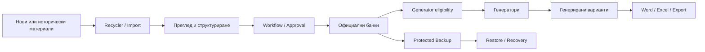
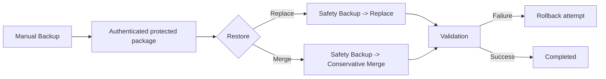
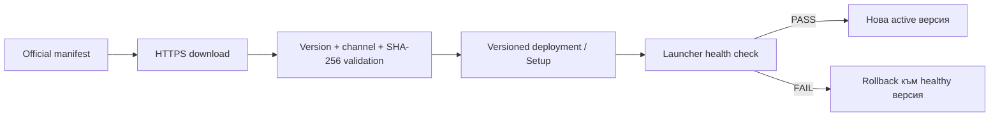

# ArsExam Desktop — официални версии, изтегляне и описание на програмата

**ArsExam Desktop** е native Windows, offline-first система за управление на дигитални ресурси, свързани с Държавния зрелостен изпит по Теория на професията **„Музикално изкуство“**.

Това repository — **`pgnev/arsexam-releases`** — е единственият официален публичен канал за:

- ArsExam Setup файлове;
- application update пакети;
- Stable/Test update manifests;
- immutable public release assets;
- публични release notes и integrity информация.

Изходният код **не се публикува тук**.

**Автор и разработчик:** Petko Ganev  
**Поддръжка:** petkoganev@gmail.com  
**Copyright © 2026 Petko Ganev. All rights reserved.**

> [!IMPORTANT]
> Изтегляйте ArsExam само от официалните Releases в това repository. Не приемайте binary от друг repository, mirror, чат или произволен file-sharing източник като официална версия само защото носи ArsExam име или икона.

---

# 1. Какво е ArsExam

ArsExam е специализирано Desktop приложение за целия локален жизнен цикъл на изпитното съдържание:


```mermaid
flowchart LR
    A[Нови или исторически материали] --> B[Recycler / Import]
    B --> C[Преглед и структуриране]
    C --> D[Workflow / Approval]
    D --> E[Официални банки]
    E --> F[Generator eligibility]
    F --> G[Генератори]
    G --> H[Генерирани варианти]
    H --> I[Word / Excel / Export]

    E --> J[Protected Backup]
    J --> K[Restore / Recovery]
```

Програмата е създадена така, че автоматизацията да подпомага експерта, но да не замества човешката преценка с догадка. Когато key, Media, provenance или структура са нееднозначни, съдържанието остава за преглед вместо да бъде автоматично „поправено“ по несигурен начин.

---

# 2. За кого е предназначена

ArsExam е предназначена за преподаватели, експерти, автори и редактори, които:

- поддържат изпитни банки;
- редактират въпроси и задачи;
- анализират исторически изпитни материали;
- изграждат и проверяват изпитни варианти;
- работят с нотни примери, изображения и аудио;
- трябва да пазят работните данни локално и да разполагат с надежден Backup/Restore механизъм.

---

# 3. Основни функции

## 3.1. Банки за трите изпитни модула

ArsExam поддържа структурирано съдържание за:

- **Модул 1** — въпроси с отговори, теми, сектори, свойства, Media, difficulty и generator rules;
- **Модул 2.1** — комплексни задачи с главни въпроси/подвъпроси, точки, key и приложими Media;
- **Модул 2.2** — отворени/практически задачи, включително Теория, Хармония и Музикални форми / анализ;
- **Модул 3** — теми, профили, номер на тема и workflow/generator state.

## 3.2. Workflow

Потребителските работни статуси са:

1. **Чернова**;
2. **За преглед**;
3. **За одобрение**;
4. **Одобрен**;
5. **Отхвърлен**;
6. **Архивиран**.

Важно: **„Одобрен“ не означава автоматично „Допустим за генератор“**. Generator eligibility се проверява отделно чрез модулните structural правила.

## 3.3. Генератори

### Модул 1

Генераторът създава точно **30 въпроса**:

| Група | Брой |
|---|---:|
| Слухови | 4 |
| Теория | 6 |
| Хармония | 7 |
| Музикални форми / анализ | 6 |
| История на музиката | 7 |
| **Общо** | **30** |

Прилагат се candidate availability, topic/structure правила, shuffle на въпросите и независимо shuffle на отговорите с запазване на верния answer mapping.

### Модул 2

Генераторите използват само structurally valid, approved и generator-eligible задачи и прилагат необходимия точков/структурен contract.

### Модул 3

Използва profile/topic generator workflow и отделни правила от числовата difficulty методология на Модул 1/2.

## 3.4. Multi-select търсене

Банките използват checkbox multi-select филтри:

- OR вътре в един categorical filter;
- AND между различни filters;
- contextual Module 1 themes;
- cumulative Module 1 properties;
- Difficulty/Status/Discipline/Profile/Topic filters според модула.

## 3.5. Difficulty methodology

ArsExam поддържа versioned difficulty methodologies, automatic explainable assessment и отделен expert override.

Модул 1/2 generator difficulty choices са concrete bands:

- **Лесно**;
- **Средно**;
- **Трудно**.

## 3.6. Recycler

Recycler обработва исторически и нови source материали и ги превръща в reviewable structured content.

Поддържаният модел включва:

- цели изпитни документи;
- смесени документи;
- самостоятелни tasks/fragments;
- key/criteria fragments;
- нотни/графични материали;
- audio;
- local OCR/layout extraction при приложимите източници.

Критичен принцип е **no silent drop**: неразпознат или нееднозначен материал трябва да остане видим чрез review state/evidence/outcome, а не да изчезне.

## 3.7. Import / Approval

Външното съдържание преминава през staging, validation, review и explicit workflow решение преди да стане official bank content.

Manual Media/association действие не auto-approve-ва съдържанието и не включва generator eligibility автоматично.

## 3.8. Media

ArsExam работи с локални:

- изображения;
- notation/score материали;
- аудио.

Missing/conflicting/ambiguous Media остава review-gated.

## 3.9. Word и Excel

- DOCX output се създава чрез Open XML;
- XLSX import/export използва ClosedXML;
- Microsoft Word/Excel не са runtime requirement за самото генериране/обработване на файловете.

## 3.10. Bank Quality

Инструментите за качество могат да подпомагат откриване и контролирана обработка на:

- duplicates;
- key conflicts;
- structural defects;
- missing Media;
- archive/merge/remove решения.

Destructive operations използват приложим preview/confirmation/audit/Safety Backup contract.

---

# 4. Offline-first работа

Основните функции работят локално и не изискват постоянен internet:

- локален профил и вход;
- банки;
- генератори;
- Recycler;
- Import/Approval;
- Word/Excel;
- Backup/Restore;
- Desktop/Portable data workflows.

Интернет се използва за:

1. официална проверка/изтегляне на update;
2. изрично подаване на лицензна заявка, проверка на състоянието и обмяна на еднократен код за активация през конфигурирания официален защитен канал;
3. доброволна opt-in crash/error диагностика, когато е включена.

Няма задължителен cloud account за normal bank/generator workflow.

---

## Лицензиране и активация в ArsExam 4.0.0

ArsExam 4.0.0 е безплатен, но изисква валиден подписан лиценз след одобрение от автора. Индивидуалният лиценз разрешава едно устройство, а институционалният — едно или две изрично посочени устройства. Стандартният срок е 12 месеца; предупреждението за подновяване започва 30 дни преди изтичане и има 7-дневен гратисен период за иначе валиден инсталиран лиценз. Не е въведена цена, платен абонамент или такса за подновяване.

Попълнете заявката с имената, длъжността, институцията, града, контактите и мотивирания текст; приемете отделно EULA и потвърдете, че сте прочели Политиката за поверителност. Изпращането става само чрез „Подай заявка за активация“. След това използвайте „Провери състоянието“ и получения за конкретното устройство еднократен код. Подаването не е автоматично одобрение. Може да се копира/запази локална заявка или да се импортира подписан лиценз от файл.

За институционални две устройства авторът трябва да получи двата кода на устройства преди издаване; всяко има отделен еднократен код. Portable/Restore/пренасяне на данни не активира друг компютър. При смяна на устройство или подновяване изпратете заявка за преглед. Валиден инсталиран лиценз позволява основната офлайн работа.

# 5. Desktop и Portable

## Desktop

Desktop installation държи versioned application binaries отделно от persistent user data.

## Portable

Portable режимът позволява пренасяне на приложението и неговия portable data root между поддържани Windows x64 компютри.

Типичните persistent категории включват:

- `Data`;
- `Media`;
- `Import`;
- `Export`;
- `Backup`;
- `Templates`;
- `Documentation`.

> [!CAUTION]
> Portable storage не означава автоматично, че всеки Media файл е индивидуално криптиран. При чувствителен removable носител използвайте подходяща OS/storage защита.

---

# 6. Локална сигурност

ArsExam използва локален защитен профилен/storage модел.

Основни принципи:

- plaintext profile password не се съхранява;
- profile password не е директно database encryption key;
- local security envelope/master-key state отделя authentication от data encryption;
- няма universal server-side master password/backdoor.

## Recovery Key

Recovery Key е локален single-use forgotten-password credential.

Той:

- не съдържа паролата;
- не е Backup password;
- не е transfer code;
- след успешно recovery се инвалидира и се издава нов.

---

# 7. Backup и Restore

ArsExam използва защитен `.arsexam-backup` формат.

Backup credential е отделен от profile password и Recovery Key.


```mermaid
flowchart LR
    A[Manual Backup] --> B[Authenticated protected package]
    B --> C{Restore}
    C -- Replace --> D[Safety Backup -> Replace]
    C -- Merge --> E[Safety Backup -> Conservative Merge]
    D --> F[Validation]
    E --> F
    F -- Failure --> G[Rollback attempt]
    F -- Success --> H[Completed]
```

### Replace

Заменя приложимото work state след validation и Safety Backup.

### Merge

Добавя допустимото incoming content консервативно, като пази current target state за съществуващи записи и блокира конфликтни methodology/file definitions преди mutation.

---

# 8. Актуализации

ArsExam използва официалните manifests в това repository.


```mermaid
flowchart LR
    A[Official manifest] --> B[HTTPS download]
    B --> C[Version + channel + SHA-256 validation]
    C --> D[Versioned deployment / Setup]
    D --> E[Launcher health check]
    E -- PASS --> F[Нова active версия]
    E -- FAIL --> G[Rollback към healthy версия]
```

Потребителските `Data/Media/Import/Export/Backup` не са normal application update payload.

Подробно описание: [`update/README.md`](update/README.md).

---

# 9. Privacy и diagnostics

Crash/error diagnostics са:

- OFF по подразбиране;
- opt-in;
- без usage/behavior analytics;
- ограничени до минимизиран technical payload според consent contract-а.

Основните банки, генератори, Recycler и Backup/Restore не изискват remote diagnostics.

---

# 10. Системни изисквания

Официалната native Desktop линия е предназначена за:

- Windows 10 / Windows 11;
- x64 архитектура.

Self-contained distribution не изисква предварително инсталиран .NET Runtime.

Няма runtime зависимост от Python, Node.js, npm, Microsoft Access, browser или localhost server.

---

# 11. Текущ официален статус

| Канал | Версия | Статус |
|---|---:|---|
| Stable | 4.0.0 | Официална текуща версия; изтегляне от Releases и Stable manifest. |
| Previous Stable | 3.9.8 | Предходна версия; файловете ѝ се запазват. |
| Withdrawn | 3.8.0 | WITHDRAWN / DO NOT INSTALL |
| Test | 3.9.2-rc.2 | Отделен канал за предварителни тестови версии. |

Текущият Stable се определя от update/stable-manifest.json и latest non-draft/non-prerelease release, обвързани с immutable source identity.

## ArsExam 4.0.0 — официална версия

[Официално издание v4.0.0](https://github.com/pgnev/arsexam-releases/releases/tag/v4.0.0), публикувано на **08.10.2026 г., 08:02:01 ч. (Europe/Sofia)** / `2026-10-08T05:02:01Z`.

- [Windows Setup](https://github.com/pgnev/arsexam-releases/releases/download/v4.0.0/ArsExam_Setup_4.0.0_win-x64.exe).
- [Update ZIP](https://github.com/pgnev/arsexam-releases/releases/download/v4.0.0/ArsExam_Update_4.0.0_win-x64.zip).
- Минимална поддържана версия: **3.0.1**; `requiresInstaller=true` — обновяването се извършва чрез пълния Setup.
- Setup и програмните файлове са **UNSIGNED с Authenticode**. Лицензните файлове използват отделен ECDSA подпис.

| Файл | SHA-256 |
|---|---|
| ArsExam_Setup_4.0.0_win-x64.exe | F65A7561CB280D791E9754396E094D18586C643B78D387BC5F5BECB499EFA8CA |
| ArsExam_Update_4.0.0_win-x64.zip | 52B9374020E0DBF77C825EFDF415A0E2268107F490E5F6CBD6A335E8F9C510CB |

Каноничен source commit: `8d9d6740f9dd7bd335351526d39838d3f452e14f`; tree: `9e841978d6b4b467b2c9e0c65027e8180ae14e08`.

Проверки: 19 release gates, 1385 .NET теста (един съществуващ opt-in skip), 58 licensing JavaScript теста; реални Desktop/Portable инсталации, обновяване от 3.9.8 и преинсталация със запазване на данните; лицензиране и Sentry диагностика — PASS. Собственикът прие документите от окончателната инсталация преди публикуване.

Microsoft Store остава отделен канал със Store-managed updates. Публикуване на GitHub Desktop/Portable не означава автоматично одобрено Store издание.

## ArsExam 3.9.8 — предходна официална версия

Published 02.10.2026,16:10:16 UTC, immutable v3.9.8 source commit 050227888af9e46fb9f4705ad960966a124e9cc8, tree 8716b530c638cfbc1f8047f419623460bf49513d.
Historical Setup SHA-256 347F6DFD219BCE068842AAADEFF1D1BB45BA3A69FC6D5D0193301F76F9DB8CE9; historical Update SHA-256 1281663254B73124BC80F482B72E45ED978538794BC834D42B241EB93E774C78. That release was unsigned and requiresInstaller=true; its assets are not changed by this transition.

## ArsExam 3.9.6 / 3.9.5 / 3.9.4 / 3.9.3 — HISTORICAL STABLES

Официалните releases `v3.9.6`, `v3.9.5`, `v3.9.4` и `v3.9.3` остават immutable historical Stable evidence; ArsExam 3.9.8 е публикуван на 02.10.2026 г. и се пази като immutable historical evidence.

## ArsExam 3.9.2 — HISTORICAL STABLE

Официален release: **`v3.9.2`**  
Публикуван: **15.09.2026, 17:10:38 UTC**

Основни assets:

- `ArsExam_Setup_3.9.2_win-x64.exe`;
- `ArsExam_Update_3.9.2_win-x64.zip`.

### SHA-256

- Setup: `07C25F4226CAD475134361EA79A22B648F464AFDF3945B9A53C97C9A1A7214F0`
- Update ZIP: `1CF8F05511079CB7BB776237F0DFB12483677BFA66736E57725AC3E766D0710E`

### Source/release binding

- canonical source: `pgnev/arsexam-source`;
- immutable source tag: `v3.9.2`;
- exact tagged source commit: `6b772dd2281d486fdd71f06e848e8ed4c92a2959`;
- exact source tree: `a1f286ca0af99834a5f5c05a2e6a965c68f982af`;
- exact-tag Windows qualification: PASS;
- full regression and Module 1 solver stress: included in Stable qualification;
- WPF validation: **84/84 PASS**;
- final exact-byte Windows acceptance: PASS;
- Sentry E2E: PASS;
- real 3.9.1 → 3.9.2 updater handoff acceptance: PASS;
- Stable manifest / public release / asset SHA-256 reconciliation: PASS;
- Authenticode signing: **NO — intentionally unsigned**.

---

## ArsExam 3.8.0 — WITHDRAWN

Официалният release `v3.8.0` се пази immutable за audit/history, но **не е текущ Stable и не трябва да бъде инсталиран или използван като update target**.

> [!CAUTION]
> При реална Windows startup acceptance версия 3.8.0 не създаде изисквания launcher health acknowledgement в допустимия прозорец. ArsExam Launcher правилно задейства automatic rollback към предишната healthy версия и възстанови резервното копие на данните. Историческият failure остава част от release provenance; текущият Stable authority се определя от `update/stable-manifest.json` и последния официален Stable release.

Исторически assets:

- `ArsExam_Setup_3.8.0_win-x64.exe`;
- `ArsExam_Update_3.8.0_win-x64.zip`;
- `update-manifest.json`.

### SHA-256

- Setup: `116AE12099572FDE26D4E406043E7316355A7B787F0945A23D18A5401C211380`
- Update ZIP: `2DC6DA5F12861CC4874EE40EA92F856B1FDCD40672D9F1D2902949DA28696C4F`

### Source/release binding

- canonical source: `pgnev/arsexam-source`;
- immutable source tag: `v3.8.0`;
- tagged source SHA: `01edd1aaa88a6ce650a5250d73e5479356b783ac`;
- validated Stable candidate SHA: `6e2891987479edd81ee7133f2e5c426bbdb10ae5`;
- regression suite: **746 passed / 0 failed / 0 skipped**;
- update stage/verify: **PASS**;
- production startup health acceptance: **FAIL — automatic rollback observed on Windows**.

---

# 12. ArsExam 3.9.1 — Historical Stable

Официален historical release: **`v3.9.1`**

Основни assets:

- `ArsExam_Setup_3.9.1_win-x64.exe`;
- `ArsExam_Update_3.9.1_win-x64.zip`.

## SHA-256

- Setup: `634A702F0AB6C7FB010F3D55C15D542ABC490CB2C863B153B51BEC68DE14B1D8`
- Update ZIP: `94F413E8E6BC1E60A9D5413907F7E1F361F735C98CF3C514B5222A933CBE30E9`

## Source/release binding

- canonical source: `pgnev/arsexam-source`;
- immutable source tag: `v3.9.1`;
- exact tagged source commit: `6ba036ae5faf8bdd0aa06bb45e9dd405e48b7629`;
- exact source tree: `a8216aa68c07b8f75c8723a5cca07b92ee382a44`;
- Authenticode signing: **NO**.

3.9.1 остава immutable historical release evidence и не е current Stable след публикуването на 3.9.2.

---

# 13. Какво включва 3.9.2

ArsExam 3.9.2 е bounded maintenance update върху 3.9.1. Той запазва установеното exam/data поведение и добавя:

- корекция в Модул 1, при която четирите задължителни слухови теми отразяват реалната candidate availability: при 0 допустими въпроса индикаторът е unchecked, а при поне 1 допустим въпрос се включва автоматично;
- запазване на правилото, че и четирите слухови теми остават задължителни за генератора;
- refresh на generator availability след промени в банката без ръчно toggle-ване на тези индикатори;
- release-tooling hardening за Test/Stable feed promotion, exact-tag qualification и owner-gated publication;
- exact-tag Windows qualification, final exact-byte acceptance, Sentry E2E и реално 3.9.1 → 3.9.2 updater handoff acceptance.

Всички публикувани 3.9.2 binaries са обвързани с immutable `v3.9.2` source tag и authoritative SHA-256 стойности.

---

# 14. Code signing — важно за Windows предупрежденията

**ArsExam 3.9.2 Stable е публикуван без Authenticode подпис.**

Поради това Windows/SmartScreen може да покаже предупреждение като **Unknown Publisher**, в зависимост от локалната policy и reputation state.

Това трябва да се различава от integrity проверката:

- HTTPS защитава transport path-а;
- SHA-256 позволява сравнение с authoritative release hash;
- Authenticode удостоверява publisher identity чрез code-signing certificate.

За 3.9.2 третият механизъм не е наличен. Signing state винаги е release-specific и не трябва да се предполага за бъдещи версии.

---

# 15. Как да изтеглите безопасно

1. Отворете официалната секция **Releases** на `pgnev/arsexam-releases`.
2. Използвайте версията, посочена в `update/stable-manifest.json` като текущ Stable.
3. За нормална инсталация използвайте съответния `ArsExam_Setup_<version>_win-x64.exe`.
4. При необходимост сравнете SHA-256 с публикуваните authoritative данни.
5. Не инсталирайте release, който е маркиран като Withdrawn, дори assets да са запазени за audit/history.
6. Не заменяйте ръчно persistent `Data`/`Backup` директории с файлове от непознат source.

За проверка на SHA-256 на текущия Stable в PowerShell:

```powershell
Get-FileHash .\ArsExam_Setup_4.0.0_win-x64.exe -Algorithm SHA256
```

Очакван SHA-256 за официалния 4.0.0 Setup:

```text
F65A7561CB280D791E9754396E094D18586C643B78D387BC5F5BECB499EFA8CA
```

---

# 16. Какво да направите при update/network проблем

При временен network failure:

- текущата working installation трябва да остане работеща;
- persistent user data не трябва да се променят;
- може да повторите update check по-късно;
- официалният fallback е Setup asset-ът от текущия Stable release в това repository.

Не изтривайте ръчно локалните банки или Backup файлове само защото update check е неуспешен.

---

# 17. Repository роли

- **`pgnev/arsexam-releases`** — единствен официален публичен binary/update authority;
- `pgnev/arsexam-source` — private canonical source/development repository;
- legacy/historical repositories не са текущият Desktop release authority.

Публикуваните release assets са immutable по release policy. Ако след публикация бъде открит дефект, корекцията трябва да бъде публикувана с **нова версия**, а не чрез тиха подмяна на стария binary.

---

# 18. Поддръжка

За техническа поддръжка:

**petkoganev@gmail.com**

Не изпращайте по email:

- profile password;
- Recovery Key;
- Backup password;
- transfer code;
- цели databases или ненужни изпитни/лични данни.

Споделяйте само минималната информация, необходима за диагностика.

---

# 19. Най-важното накратко

> **ArsExam Desktop е локална професионална система за изпитни банки, Recycler/Import, approval workflow, генератори, Word/Excel обмен и защитено Backup/Restore. Това repository е единственият официален публичен източник за неговите binaries и update manifests. Текущият Stable се определя от съгласуваните официален release и Stable manifest.**

## Граница на съдържанието

Софтуерът ArsExam не съдържа, не разпространява и не предоставя достъп до служебно, поверително или защитено съдържание, свързано с ДЗИ по Теория на професията „Музикално изкуство“. Програмата представлява единствено софтуерен инструмент за създаване, редактиране, организиране и управление на съдържание, въведено или създадено от надлежно оторизирани потребители.

Публично разпространяваният изпълним софтуер не включва база данни с реални служебни изпитни материали, задачи, отговори или други защитени данни.
