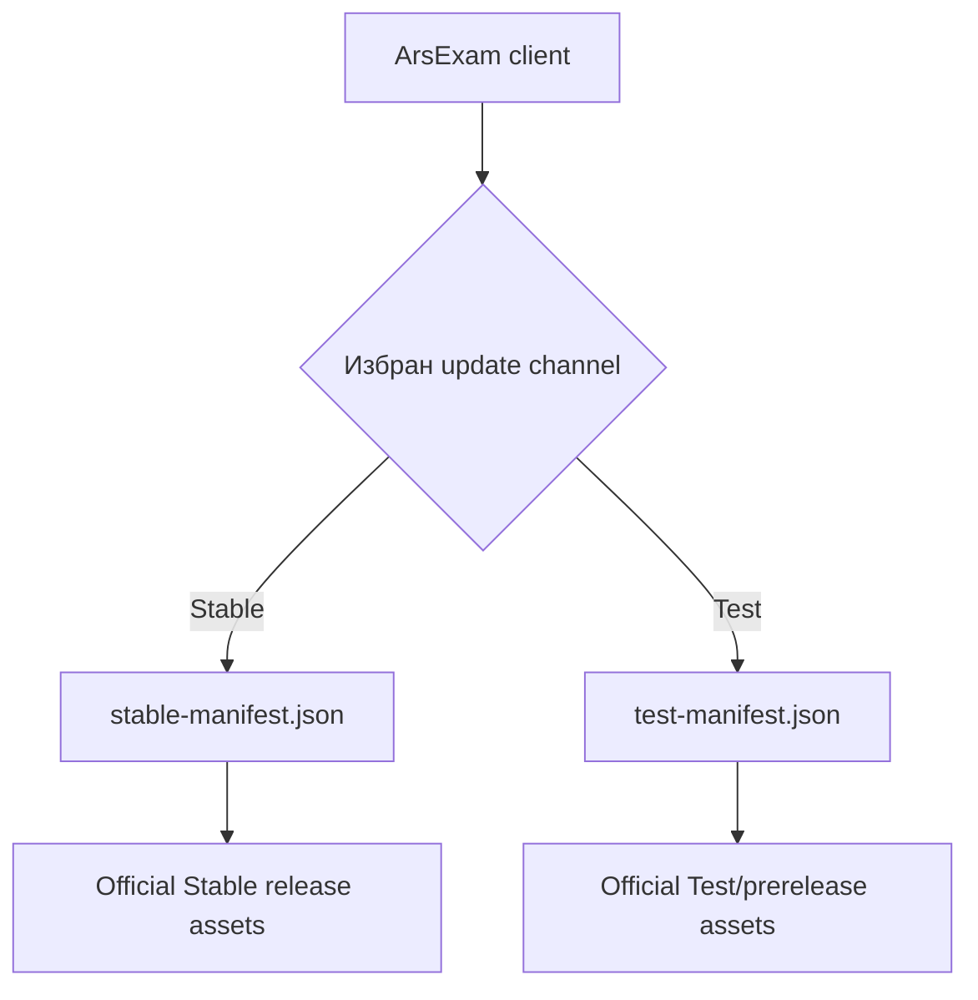
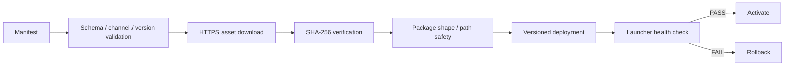
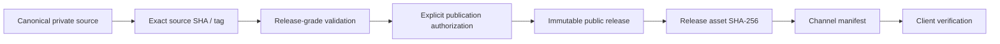

# ArsExam — публични update manifests

Тази директория съдържа **machine-readable публичните manifests**, които поддържаните ArsExam Desktop клиенти използват при проверка за актуализации.

Това не е място за ръчно качване на произволни binaries или за „превключване“ на Stable чрез редакция на текстов файл. Manifest-ите са част от контролиран release/update trust chain.

> [!IMPORTANT]
> `pgnev/arsexam-releases` е единственият официален публичен distribution/update authority за ArsExam Desktop.

---

## 1. Какво представлява manifest-ът

Manifest-ът е малък JSON документ, който описва каква версия може да бъде предложена на даден update channel и кои assets принадлежат към нея.

Той може да съдържа например:

- schema version;
- channel;
- application version;
- minimum supported version;
- HTTPS URL към application package или Setup;
- SHA-256 на package/installer;
- дали е необходим installer;
- release notes;
- UTC publication timestamp.

Manifest-ът **не съдържа самата програма**. Той сочи към валидиран public release asset и позволява на клиента да провери дали изтегленият файл съвпада с очаквания.

---

## 2. Канали

### `stable-manifest.json`

Production Stable channel.

Използва се от потребители, които искат официалната стабилна версия.

### `test-manifest.json`

Test/Beta/RC channel.

Използва се само при изричен opt-in към testing/prerelease линия.



Test/RC manifest **не трябва** да се превръща в Stable само чрез copy/rename. Stable promotion е отделна контролирана publication операция.

---

## 3. Какво прави клиентът с manifest-а

Типичният update flow е:

1. ArsExam изтегля manifest-а по HTTPS;
2. проверява schema/channel/version полетата;
3. сравнява offered version с текущата версия;
4. проверява minimum supported/update policy;
5. избира application-only package или Full Setup според manifest-а;
6. изтегля съответния asset;
7. изчислява SHA-256;
8. сравнява го с authoritative digest-а;
9. проверява package shape/security rules;
10. едва след това продължава към deployment/activation.



---

## 4. Какво никога не трябва да има в manifest

Публичният manifest не трябва да съдържа:

- credentials;
- API secrets;
- profile password;
- Recovery Key;
- Backup password;
- transfer codes;
- потребителски данни;
- diagnostics payload;
- локални filesystem paths;
- private repository URL, който изисква authentication;
- source code;
- private build mapping/evidence, което не е предназначено за публична дистрибуция.

Manifest-ът съдържа само минималната public metadata, необходима за update клиента.

---

## 5. Trust chain

Manifest-ът е **само една част** от доверието.

Каноничният модел е:



Controlled publisher трябва да провери приложимите:

- source workflow/run identity;
- source commit SHA;
- version/tag consistency;
- release-context evidence;
- expected Setup/update assets;
- SHA-256 values;
- channel/promotion rules.

Не трябва ръчно да се редактира manifest така, че да сочи към asset, който не е произведен и валидиран от съответния controlled release process.

---

## 6. Stable не се определя само от manifest

Публичният Stable status е по-широк contract.

Той трябва да е съгласуван между:

1. public `stable-manifest.json`;
2. latest non-draft, non-prerelease release в `pgnev/arsexam-releases`;
3. checked-in current Stable identity в canonical source repository.

Branch, CI artifact, tag или локален candidate не е автоматично Stable.

---

## 7. Anti-downgrade правило

Publication tooling не трябва тихо да заменя channel manifest с по-стара версия.

Изключителен rollback, ако някога е необходим по security/operations причина, трябва да бъде:

- explicit;
- документиран;
- съвместим с data/schema rules;
- изпълнен като контролирана операция, а не чрез случайна ръчна промяна.

---

## 8. Application-only package и Full Setup

Manifest-ът позволява client-ът да разбере кой delivery path е приложим.

### Application-only

Подходящ само когато:

- release context го разрешава;
- deployment-owned компоненти не изискват installer migration;
- текущата версия е над необходимия update floor;
- package integrity/shape е валидна.

### Full Setup

Изисква се при промени по:

- Launcher;
- installer/deployment layout;
- други deployment-owned компоненти;
- или когато текущата версия е под minimum floor за application-only update.

Точната policy е release-specific и не трябва да се hard-code-ва като универсално правило в README.

---

## 9. Защо SHA-256 е в manifest-а

SHA-256 позволява клиентът да провери, че bytes на изтегления asset са точно тези, които release authority е публикувал.

При mismatch пакетът трябва да бъде отхвърлен.

Integrity failure не трябва да се „заобикаля“ чрез:

- игнориране на hash-а;
- ръчно изключване на validation;
- приемане на друг файл със същото име;
- подмяна на manifest digest към непроверен binary.

> [!NOTE]
> SHA-256 integrity не е равнозначна на Authenticode publisher identity. Code-signing статусът на дадена версия се описва отделно.

---

## 10. Persistent user data и update feed

Update manifest-ът описва application delivery, не user backup/data migration.

Нормалният application update payload не трябва да включва persistent категории като:

- `Data`;
- `Media`;
- `Import`;
- `Export`;
- `Backup`.

Това е важно, за да не може update да презапише изпитните банки и Backup файловете като страничен ефект.

---

## 11. Network failure и offline-first поведение

ArsExam е offline-first. Липсата на мрежа означава, че update check/download може да бъде недостъпен, но не трябва да спира локалните банки, генератори, Recycler или Backup/Restore.

При recoverable transport проблем клиентът може да използва bounded retry/fallback поведение.

При integrity/package failure се прилага fail-closed поведение.

Текущата healthy installation трябва да остане използваема при failed update check.

---

## 12. Immutable public releases

Публикуваните version tags и assets не трябва да се променят постфактум.

Ако след publication се открие дефект:

- не се заменя старият Setup със „същата версия, но нови bytes“;
- не се пренаписва hash-ът към нов asset със старо version identity;
- не се мести immutable tag;
- публикува се нова версия след нов validation/publication cycle.

Manifest-ът съответно се promote-ва към новата версия само след успешната контролирана публикация.

---

## 13. Repository compatibility

Официалният текущ public distribution authority е:

```text
pgnev/arsexam-releases
```

Legacy/historical repositories не са independent current release authorities.

По-стари клиенти могат исторически да са имали compatibility URL логика, но текущият official distribution contract трябва да сочи към този repository.

---

## 14. За разработчици — правила при редакция

Преди промяна на public manifest трябва да е известно:

- коя exact source версия се публикува;
- кой tag/commit я идентифицира;
- кои assets са authoritative;
- какви са точните им SHA-256 hashes;
- какъв е каналът;
- необходимо ли е Full Setup;
- какъв е minimum supported version contract;
- има ли необходимата explicit publication authorization.

Не редактирайте manifest „предварително“, само защото build-ът изглежда готов.

Green CI ≠ Stable publication authorization.

Tag ≠ Stable.

Manifest edit ≠ release validation.

---

## 15. Какво вижда крайният потребител

При нормална проверка за update потребителят не работи директно с JSON файла.

ArsExam използва manifest-а във фоновия update workflow и показва приложим user-facing резултат:

- версията е актуална;
- има налична нова версия;
- няма network връзка / check може да се повтори;
- update е disabled/manual според настройката;
- package/update failure е блокиран безопасно.

Потребителят не трябва ръчно да „поправя“ manifest или да копира файлове в program directory, за да довърши update.

---

## 16. Свързана публична информация

Общото описание на ArsExam Desktop, текущият Stable release, SHA-256 hashes и указанията за изтегляне са в:

[`../README.md`](../README.md)

Официалните release assets са в секцията **Releases** на това repository.

---

## 17. Най-важното правило

> **Public manifest се променя само като част от валидирана и изрично разрешена publication операция; той никога не трябва да сочи към непроверен или произволно подменен ArsExam binary.**
